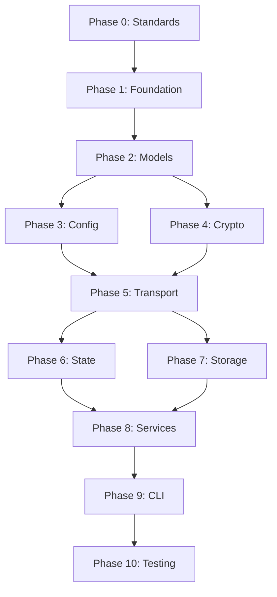

# Obsync Implementation Guide

This directory contains the comprehensive implementation plan for the Obsync vault synchronization client. Each phase is documented with concrete examples, configurations, and deliverables.

## Phase Overview

The implementation is divided into 11 phases (0-10), each building upon the previous:

### Phase 0: Standards & Infrastructure
**File:** [phase-0-standards.md](phase-0-standards.md)
- Coding standards with concrete examples
- golangci-lint configuration
- CI/CD pipeline setup
- Git workflow and commit conventions

### Phase 1: Project Foundation
**File:** [phase-1-foundation.md](phase-1-foundation.md)
- Directory structure and organization
- Go module initialization
- Core tooling setup (cobra, testify)
- Naming conventions implementation

### Phase 2: Core Models
**File:** [phase-2-models.md](phase-2-models.md)
- WebSocket message specifications
- Error codes and types
- Data structure definitions
- Test fixtures and examples

### Phase 3: Configuration & Logging
**File:** [phase-3-config-logging.md](phase-3-config-logging.md)
- Environment variable handling
- Configuration file formats
- Structured logging implementation
- Debug and trace capabilities

### Phase 4: Cryptography
**File:** [phase-4-cryptography.md](phase-4-cryptography.md)
- AES-GCM implementation details
- Key derivation (PBKDF2)
- Path decryption logic
- Security review checklist

### Phase 5: Transport Layer
**File:** [phase-5-transport.md](phase-5-transport.md)
- HTTP client with retry logic
- WebSocket connection handling
- Message parsing and validation
- Mock transport for testing

### Phase 6: State Management
**File:** [phase-6-state.md](phase-6-state.md)
- JSON state file format
- SQLite schema (optional)
- Migration strategies
- Corruption recovery

### Phase 7: Storage Layer
**File:** [phase-7-storage.md](phase-7-storage.md)
- Path sanitization rules
- Conflict resolution strategy
- Binary file detection
- Safe file operations

### Phase 8: Core Services
**File:** [phase-8-services.md](phase-8-services.md)
- Authentication flow
- Sync engine implementation
- Progress reporting format
- Event emission patterns

### Phase 9: CLI Interface
**File:** [phase-9-cli.md](phase-9-cli.md)
- Cobra command structure
- Flag definitions
- Output formatting
- Error display standards

### Phase 10: Testing & Quality
**File:** [phase-10-testing.md](phase-10-testing.md)
- Coverage requirements (85% unit, 80% mutation)
- Integration test scenarios
- Performance benchmarks
- Release criteria

## Phase Dependencies

## Deliverable Timeline

| Phase | Duration | Key Deliverables |
|-------|----------|------------------|
| 0 | 2 days | CI/CD pipeline, linting rules |
| 1 | 1 day | Project structure, basic CLI |
| 2 | 2 days | All models with 100% test coverage |
| 3 | 1 day | Config system, structured logs |
| 4 | 3 days | Crypto implementation, security tests |
| 5 | 3 days | Transport layer with mocks |
| 6 | 2 days | State persistence layer |
| 7 | 2 days | File system operations |
| 8 | 4 days | Complete sync engine |
| 9 | 2 days | Full CLI with all commands |
| 10 | 3 days | Test suite, benchmarks, docs |

**Total: ~25 days**

## Critical Success Factors

1. **Standards Compliance**: Every phase must pass golangci-lint and achieve coverage targets
2. **Security First**: All crypto operations must be reviewed and tested with known vectors
3. **Resumability**: Sync must handle interruptions gracefully at any point
4. **Testability**: All components must be mockable and testable in isolation
5. **Cross-Platform**: Code must work on Linux, macOS, and Windows

## Getting Started

1. Start with [phase-0-standards.md](phase-0-standards.md) to set up your development environment
2. Follow phases sequentially as later phases depend on earlier ones
3. Run `make lint test` after each phase to ensure compliance
4. Use the test fixtures provided in each phase document

## Additional Resources

- [CLAUDE.md](../CLAUDE.md) - AI-assisted development guidelines
- [troubleshooting.md](troubleshooting.md) - Common issues and solutions
- [fixtures/](fixtures/) - Test data and WebSocket traces